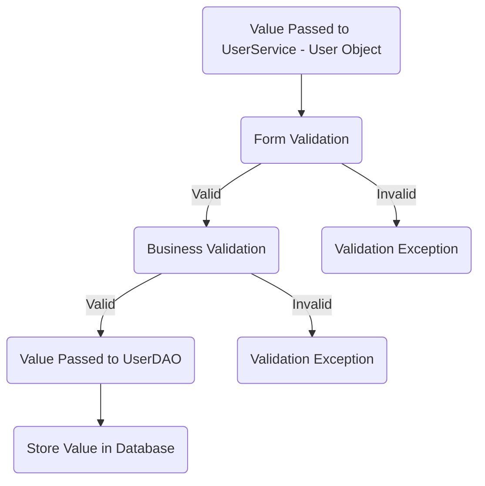
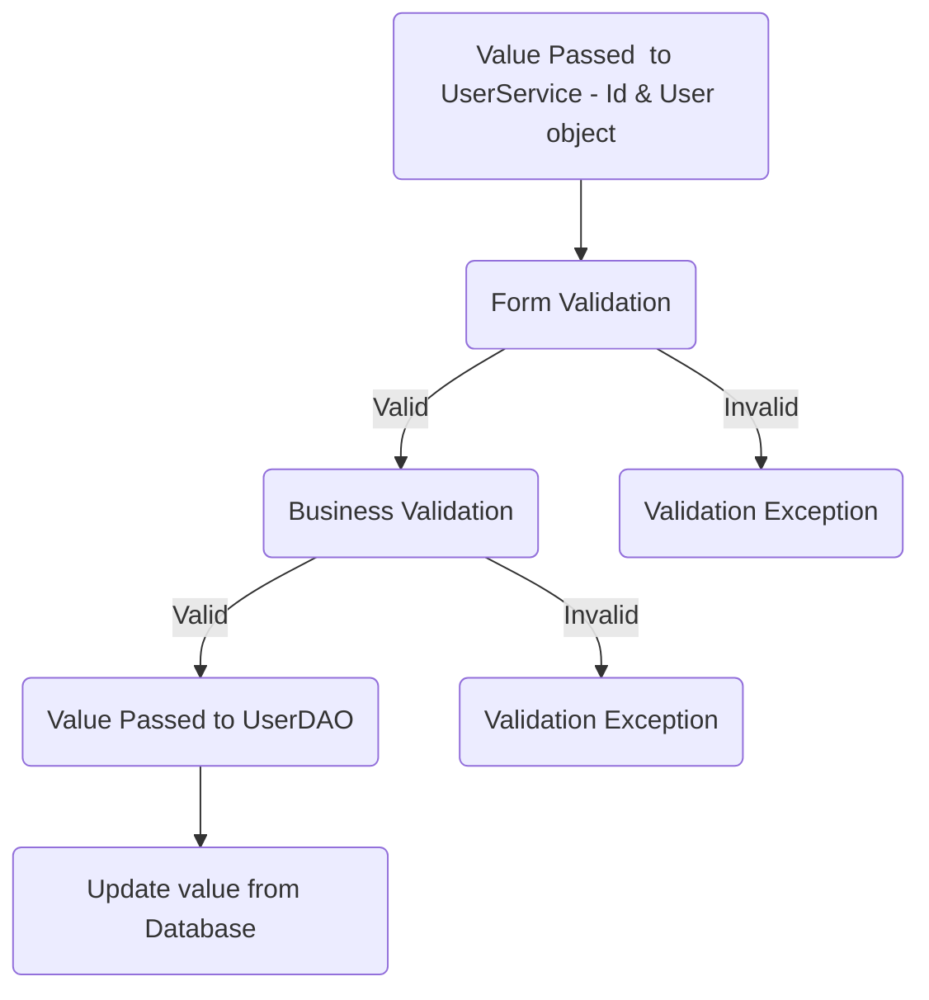
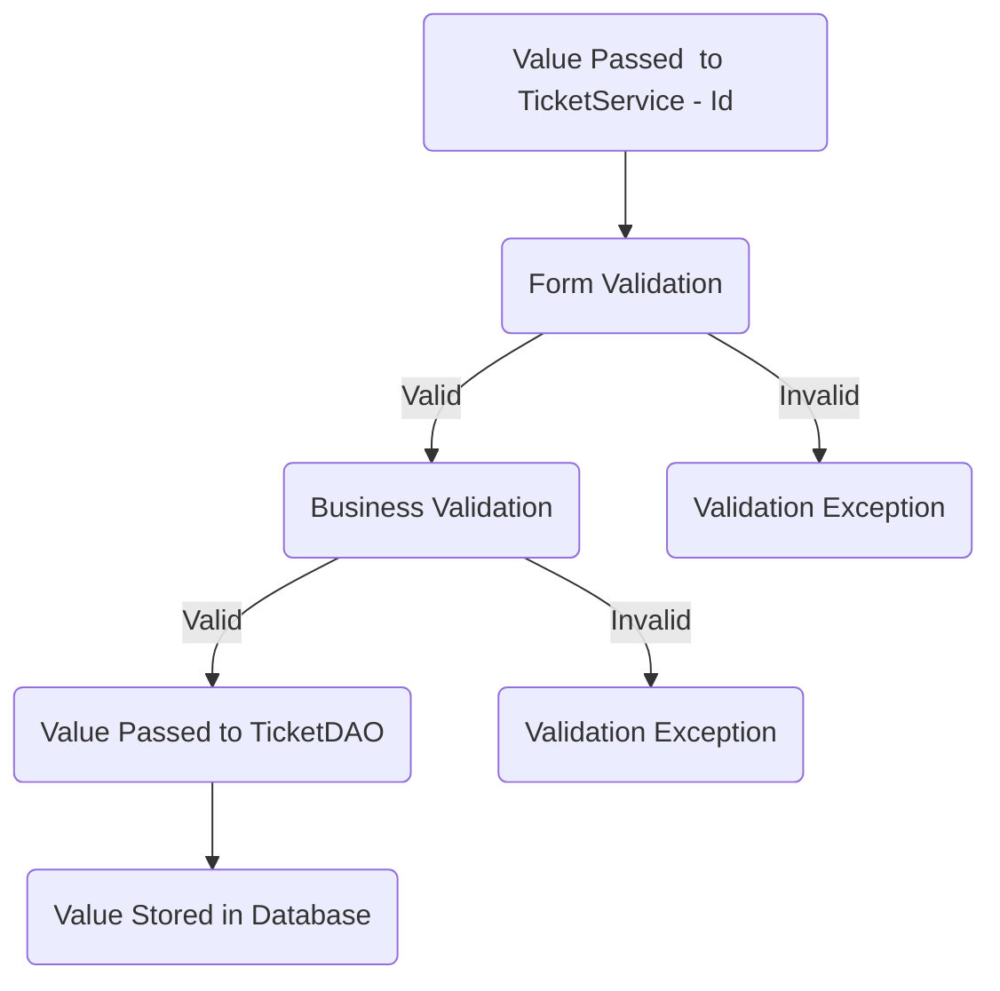
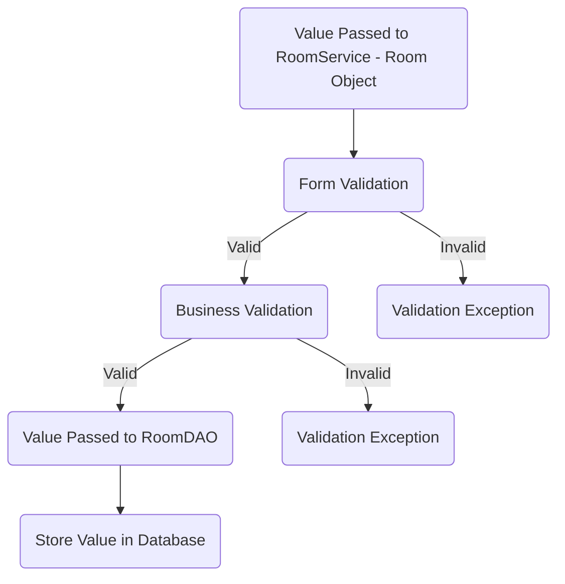
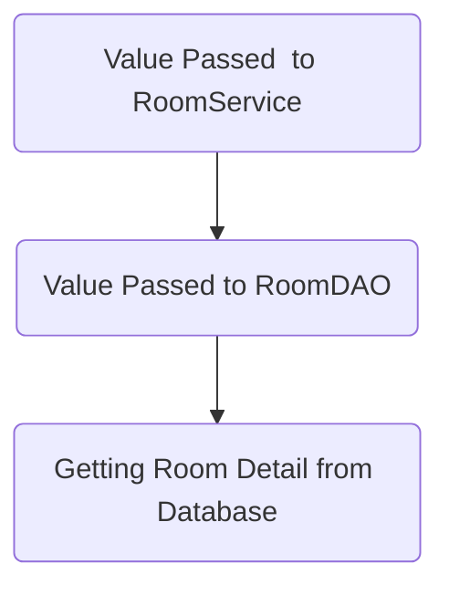
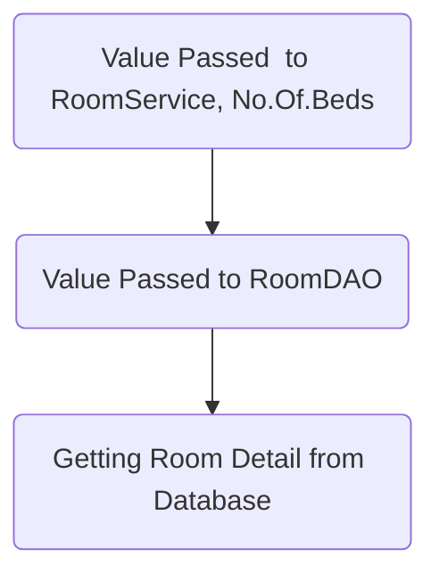
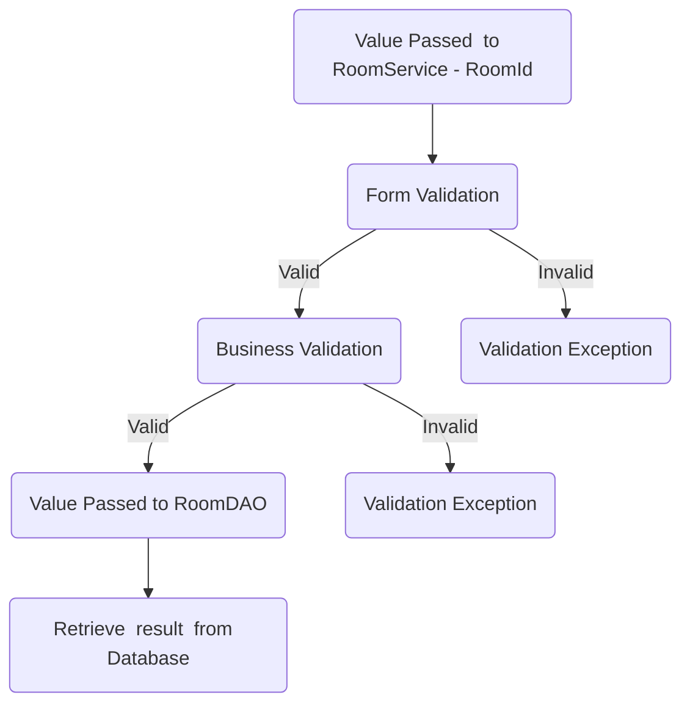

# Global Fun City

## Database Design

- [ ] ER diagram of the database 

## Project Setup

- [ ] Create a new Java project
- [ ] Set up a MySQL database
- [ ] Add necessary libraries
	- [ ] JDBC, 
	- [ ] MySQL Connector, 
	- [ ] JUnit, 
	- [ ] Dotenv

## Module: User 
- [ ] Users Table
### Feature: Create User
#### User Story:
> User can create a new account.
#### Pre-requisites:
- [ ] Create User table
- [ ] User model
- [ ] User DAO (create)
- [ ] User Service (create)

#### Validations:
- [ ] Form Validation
-  User Null
-  Name ( null, empty, pattern )
-  Email ( null, empty, pattern )
-  Password ( null, empty, pattern )
-  Phone number ( length, >= 600000001 && <= 9999999999 )

- [ ] Business Validation 
- Email Already exists.

#### Messages: 
-   User object can not be null.
-   Name cannot be null or empty.
-   Email cannot be null or empty.
-   Email does not match the pattern.
-   Password can not be null or empty.
-   Password does not match the pattern.
-   Phone number can not be less than or more than 10 digits.
-   Phone number does not match the pattern.
-   User already exists.

#### Flow:  

### Feature: Update User Details
#### User Story:
> Existing user can update their details.

#### Pre-requisites:
- [ ]  User DAO (update)
    
- [ ]  User Service (update)

#### Validations:

- [ ] Form Validation:
-   Id <= 0
 -  User Object
    -   User null
    -   Name ( null, empty, pattern )
    -   Password ( null, empty, pattern )
    -   Phone number ( length, >= 600000001 && <= 9999999999 )
  
   - [ ] Business Validation:
   -   Check whether the Id exists.

#### Messages:
-   User Id cannot be less than zero.
-   User object cannot be null.
-   Name cannot be null or empty.
-   Password cannot be null or empty.
-   Password does not match the pattern.
-   Phone number cannot be less than or more than 10 digits.
-   Phone number does not match the pattern.
-   Id doesn't exists.

#### Flow:

## Module: Ticket
- [ ] Ticket Table

### Feature: Book New Ticket
#### User Story:
> User can book ticket.

#### Pre-requisites:
- [ ]  Create Ticket table
- [ ]  Ticket model
- [ ]  Ticket DAO (create)
- [ ]  Ticket Service (create)

#### Validation:
- [ ] Form Validation:

-   User ID ( <= 0)
-   Number of Adults ( <= 0 )
-   Number of Children ( < 0 )
-   From Date (null or empty , Pattern, valid range)
-   To Date (null or empty , Pattern, valid range)

- [ ] Business Validation:
- Check If the user is already exists in user table.

#### Messages:

-  User Id cannot be less than zero.
-  Number of adults is greater than 0.
-  Number of children is greater than or equal to 0.
-  From date is not null or empty or invalid pattern.
-  To date is not null or empty or invalid pattern.
- User doesn't exist
#### Flow:

### Feature: Booking History
#### User Story:

> User can view their booking history.

#### Pre-requisites:
- [ ] Ticket Table
- [ ] Ticket DAO (FindAll BookedTicketsByUserId)
- [ ] Ticket Service (FindAll BookedTicketsByUserId)

#### Validation: 
- [ ] Form Validation:
- Id  ( <= 0 )
- [ ] Business Validation:
- Check If the user is already exists in user table.

#### Messages:
-  Id can't be less than zero
- User doesn't exist

#### Flow:

## Module: Rooms
- [ ] Room Table

### Feature: Create New Rooms
#### User Story:
> Create new room
####  Pre-requisites:
- [ ]  Create Rooms Table
- [ ]  Rooms Model
- [ ]  Rooms DAO (create)
- [ ]  Rooms Service (create)

#### Validation:
- [ ] Form Validation
-   Hotel Name (null, empty)
-   Room Name (null, empty)
-   Number of Beds ( <= 0 )
-   Price (Positive integer)
 
#### Messages:
- Hotel Name cannot be null or empty.
- Room Name cannot be null or empty.
- Number of beds should be in an positive integer.
- Price should be an positive integer.
 
 #### Flow:

 
### Feature: List all Rooms
#### Story:
> Can see list of rooms.

#### Pre-requisites:
- [ ]    Create New Rooms must be completed.
- [ ]   Rooms Model
- [ ]   Rooms DAO (FindAllRooms)
- [ ]   Rooms Service (FindAllRooms)

### Flow:

### Feature: List all Rooms by No.Of.Beds
#### Story:
> Can see list of rooms with no.of.beds

#### Pre-requisites:
- [ ]    Create New Rooms must be completed.
- [ ]   Rooms Model
- [ ]   Rooms DAO (FindAllRoomsByNo.Of.Beds)
- [ ]   Rooms Service (FindAllRoomsByNo.Of.Beds)

#### Flow:

### Feature: Update Room Details
> Can Update Room Details.

#### Pre-requisites:
- [ ]   Feature: Create New Rooms must be completed.
- [ ]   Rooms Model
- [ ]   Rooms DAO (update)
- [ ]   Rooms Service (update)

#### Validation:

- [ ] Form Validation
-   Room ID ( <= 0  )
-   Hotel Name (not null, not empty)
-   Room Name (not null, not empty)
-   Number of Beds (<= 0)
-   Price (Positive integer)

#### Flow:

